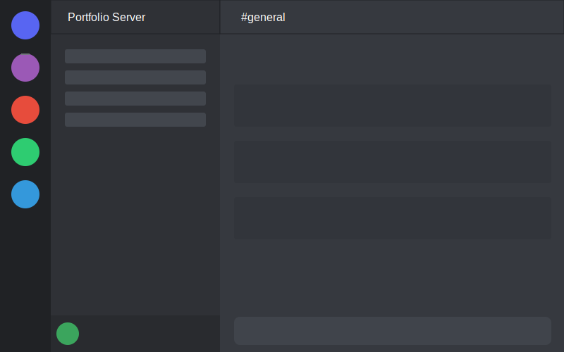

# Discord Clone

A pixel-perfect Discord UI clone built with vanilla HTML, CSS, and JavaScript. This project is designed to showcase front-end development skills and understanding of modern UI design principles.



## Features

- **Complete Discord UI**: Recreates the entire Discord interface with pixel-perfect accuracy
- **Interactive Elements**: Functional buttons, modals, and form inputs
- **User Status System**: Change your online status (Online, Idle, Do Not Disturb, Invisible)
- **Server Management**: Add and customize new servers
- **Message System**: Send text messages and attachments
- **Channel Navigation**: Switch between different channels
- **Responsive Design**: Adapts to different screen sizes
- **Custom SVG Assets**: All icons and avatars are custom SVG images for optimal loading
- **Easter Eggs**: Try the Konami code! (↑ ↑ ↓ ↓ ← → ← → B A)

## Technologies Used

- HTML5
- CSS3 with custom variables
- Vanilla JavaScript (ES6+)
- SVG for icons and illustrations
- Font Awesome for icons

## Getting Started

1. Clone the repository:
   ```
   git clone https://github.com/yourusername/discord-clone.git
   ```

2. Open the project:
   ```
   cd discord-clone
   ```

3. Launch the application:
   - Open `index.html` in your browser
   - Alternatively, use a local server like Live Server (VS Code extension)

## Project Structure

```
discord-clone/
├── assets/
│   ├── icons/        # SVG icons and avatars
│   └── images/       # Other images and thumbnails
├── css/
│   └── styles.css    # All the styling for the application
├── js/
│   └── app.js        # Main JavaScript functionality
├── index.html        # Main HTML file
└── README.md         # This file
```

## Customization

You can customize various aspects of the application:

- **Theme**: Modify the CSS variables in `styles.css` to change colors
- **User Information**: Update the user info in `app.js`
- **Server Icons**: Add or modify SVG icons in the assets directory

## Browser Support

The application works on all modern browsers:
- Chrome (latest)
- Firefox (latest)
- Safari (latest)
- Edge (latest)

## License

This project is available under the MIT License. See the LICENSE file for more information.

## Acknowledgements

- This project is for educational purposes only
- Discord is a trademark of Discord Inc. This project is not affiliated with or endorsed by Discord Inc.
- Font Awesome for the icon library

## Connect

- Portfolio: [Your Portfolio](https://your-portfolio-url.com)
- GitHub: [Your GitHub](https://github.com/yourusername)
- LinkedIn: [Your LinkedIn](https://linkedin.com/in/yourusername) 